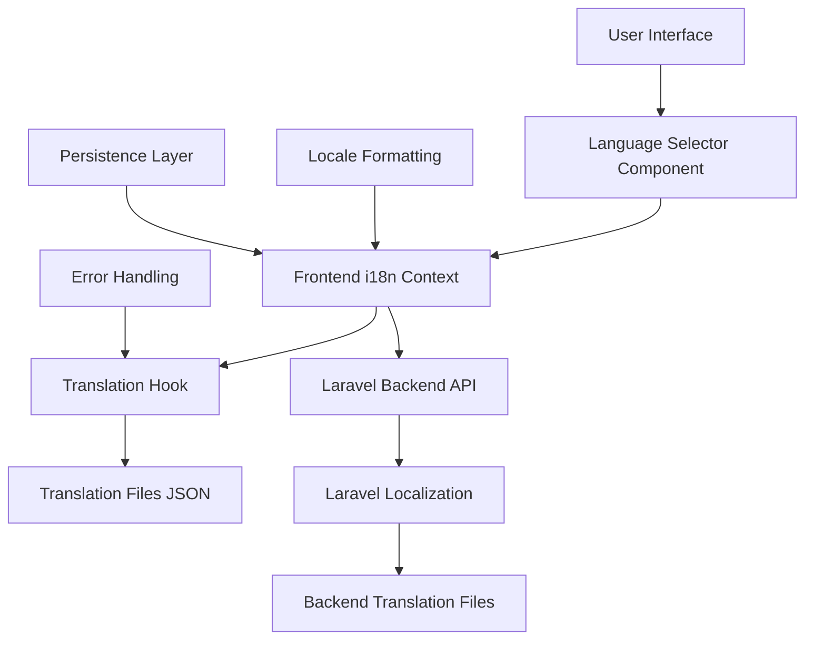

# Multilingual Support Design Document

## Overview

This design implements a comprehensive multilingual support system for the Laravel + React/TypeScript application. The solution provides dynamic language switching, efficient translation management, and follows internationalization best practices. The architecture leverages Laravel's built-in localization features on the backend and implements a custom React i18n solution on the frontend.

### Supported Languages
- English (en) - Default
- Spanish (es)
- Chinese Simplified (zh-CN)
- French (fr)
- German (de)
- Portuguese Brazilian (pt-BR)

## Architecture

### High-Level Architecture



### Frontend Architecture

The frontend will use a custom React Context-based i18n system with the following components:

1. **i18n Context Provider**: Manages current language state and translation functions
2. **Translation Hook**: Provides translation utilities to components
3. **Language Selector**: UI component for language switching
4. **Translation Files**: JSON files containing translations organized by language
5. **Locale Formatting**: Utilities for date, number, and currency formatting

### Backend Architecture

The backend leverages Laravel's built-in localization system:

1. **Locale Middleware**: Sets application locale based on user preference
2. **Translation Files**: PHP/JSON files for server-side translations
3. **API Endpoints**: Provide translation data and handle locale switching
4. **User Preference Storage**: Persist language preferences in database/session

## Components and Interfaces

### Frontend Components

#### 1. i18n Context Provider

```typescript
interface I18nContextType {
  currentLanguage: string;
  availableLanguages: Language[];
  t: (key: string, params?: Record<string, any>) => string;
  changeLanguage: (language: string) => Promise<void>;
  formatDate: (date: Date, options?: Intl.DateTimeFormatOptions) => string;
  formatNumber: (number: number, options?: Intl.NumberFormatOptions) => string;
  formatCurrency: (amount: number, currency: string) => string;
}

interface Language {
  code: string;
  name: string;
  nativeName: string;
  flag: string;
  rtl: boolean;
}
```

#### 2. Translation Hook

```typescript
interface UseTranslationReturn {
  t: (key: string, params?: Record<string, any>) => string;
  currentLanguage: string;
  isLoading: boolean;
  error: string | null;
}

function useTranslation(): UseTranslationReturn;
```

#### 3. Language Selector Component

```typescript
interface LanguageSelectorProps {
  variant?: 'dropdown' | 'buttons';
  showFlags?: boolean;
  showNativeNames?: boolean;
  className?: string;
}

function LanguageSelector(props: LanguageSelectorProps): JSX.Element;
```

#### 4. Translation Files Structure

```json
{
  "common": {
    "buttons": {
      "save": "Save",
      "cancel": "Cancel",
      "submit": "Submit"
    },
    "navigation": {
      "home": "Home",
      "about": "About",
      "contact": "Contact"
    }
  },
  "pages": {
    "welcome": {
      "title": "Get Smart Feedback on Your {{type}} Projects. Instantly.",
      "subtitle": "Upload your web or app projects and receive personalized feedback"
    }
  },
  "validation": {
    "required": "This field is required",
    "email": "Please enter a valid email address"
  }
}
```

### Backend Components

#### 1. Locale Middleware

```php
class SetLocaleMiddleware
{
    public function handle(Request $request, Closure $next)
    {
        $locale = $this->determineLocale($request);
        App::setLocale($locale);
        return $next($request);
    }
    
    private function determineLocale(Request $request): string
    {
        // Priority: URL parameter > User preference > Accept-Language header > Default
    }
}
```

#### 2. Translation API Controller

```php
class TranslationController extends Controller
{
    public function getTranslations(string $locale): JsonResponse
    {
        // Return frontend translation files
    }
    
    public function setUserLocale(Request $request): JsonResponse
    {
        // Persist user language preference
    }
}
```

#### 3. Translation Service

```php
class TranslationService
{
    public function getTranslationsForLocale(string $locale): array;
    public function translateDynamicContent(array $content, string $locale): array;
    public function validateTranslationKeys(array $keys): array;
}
```

## Data Models

### Frontend Translation Data

```typescript
interface TranslationData {
  [locale: string]: {
    [namespace: string]: {
      [key: string]: string | TranslationData;
    };
  };
}

interface LanguageConfig {
  code: string;
  name: string;
  nativeName: string;
  flag: string;
  rtl: boolean;
  dateFormat: string;
  numberFormat: {
    decimal: string;
    thousands: string;
  };
  currency: {
    symbol: string;
    position: 'before' | 'after';
  };
}
```

### Backend Models

```php
// Migration for user language preferences
Schema::table('users', function (Blueprint $table) {
    $table->string('preferred_locale', 10)->default('en');
});

// Configuration array
$languages = [
    'en' => ['name' => 'English', 'native' => 'English', 'flag' => '🇺🇸'],
    'es' => ['name' => 'Spanish', 'native' => 'Español', 'flag' => '🇪🇸'],
    'zh-CN' => ['name' => 'Chinese (Simplified)', 'native' => '简体中文', 'flag' => '🇨🇳'],
    'fr' => ['name' => 'French', 'native' => 'Français', 'flag' => '🇫🇷'],
    'de' => ['name' => 'German', 'native' => 'Deutsch', 'flag' => '🇩🇪'],
    'pt-BR' => ['name' => 'Portuguese (Brazil)', 'native' => 'Português (Brasil)', 'flag' => '🇧🇷'],
];
```

## Error Handling

### Frontend Error Handling

1. **Missing Translation Keys**: Display key name with visual indicator in development
2. **Translation Loading Failures**: Graceful fallback to English with error logging
3. **Network Errors**: Retry mechanism with exponential backoff
4. **Invalid Language Codes**: Fallback to default language

```typescript
class TranslationError extends Error {
  constructor(
    public key: string,
    public locale: string,
    public context?: string
  ) {
    super(`Translation missing: ${key} for locale ${locale}`);
  }
}
```

### Backend Error Handling

1. **Invalid Locale Requests**: Return 400 with supported locales list
2. **Missing Translation Files**: Log error and return fallback translations
3. **Database Errors**: Graceful degradation to session-based storage

## Testing Strategy

### Frontend Testing

1. **Unit Tests**:
   - Translation hook functionality
   - Language switching logic
   - Formatting utilities
   - Error handling scenarios

2. **Integration Tests**:
   - Context provider behavior
   - Component translation rendering
   - Language selector interactions

3. **E2E Tests**:
   - Complete language switching flow
   - Persistence across page reloads
   - Mixed static/dynamic content translation

### Backend Testing

1. **Unit Tests**:
   - Translation service methods
   - Locale middleware logic
   - API endpoint responses

2. **Feature Tests**:
   - Complete translation API workflow
   - User preference persistence
   - Fallback behavior

### Test Data

```typescript
// Frontend test translations
const testTranslations = {
  en: { test: { key: "English text" } },
  es: { test: { key: "Texto en español" } },
  'zh-CN': { test: { key: "中文文本" } }
};
```

## Implementation Phases

### Phase 1: Core Infrastructure
- Set up translation file structure
- Implement i18n context and hook
- Create basic language selector
- Add locale middleware

### Phase 2: Translation Management
- Implement translation loading system
- Add error handling and fallbacks
- Create development tools for missing translations
- Set up hot reloading in development

### Phase 3: Formatting and Localization
- Implement date/time formatting
- Add number and currency formatting
- Handle locale-specific formatting rules
- Add RTL support preparation

### Phase 4: Dynamic Content Support
- Implement API translation endpoints
- Add server-side translation capabilities
- Handle mixed static/dynamic content
- Optimize performance with caching

### Phase 5: User Experience
- Add persistence layer
- Implement user preference storage
- Optimize loading performance
- Add accessibility features

## Performance Considerations

1. **Lazy Loading**: Load translations on demand
2. **Caching**: Cache translations in memory and localStorage
3. **Bundle Splitting**: Separate translation files by language
4. **Compression**: Gzip translation files
5. **CDN**: Serve translation files from CDN for global users

## Security Considerations

1. **Input Validation**: Validate locale codes against whitelist
2. **XSS Prevention**: Sanitize dynamic translation parameters
3. **CSRF Protection**: Protect language preference endpoints
4. **Rate Limiting**: Limit translation API requests

## Accessibility

1. **Screen Readers**: Proper ARIA labels for language selector
2. **Keyboard Navigation**: Full keyboard support for language switching
3. **High Contrast**: Ensure language selector works with high contrast themes
4. **Language Announcements**: Announce language changes to screen readers

## Browser Compatibility

- Modern browsers with ES2018+ support
- Intl API support for formatting (polyfill for older browsers)
- localStorage support for persistence
- CSS Grid/Flexbox for layout